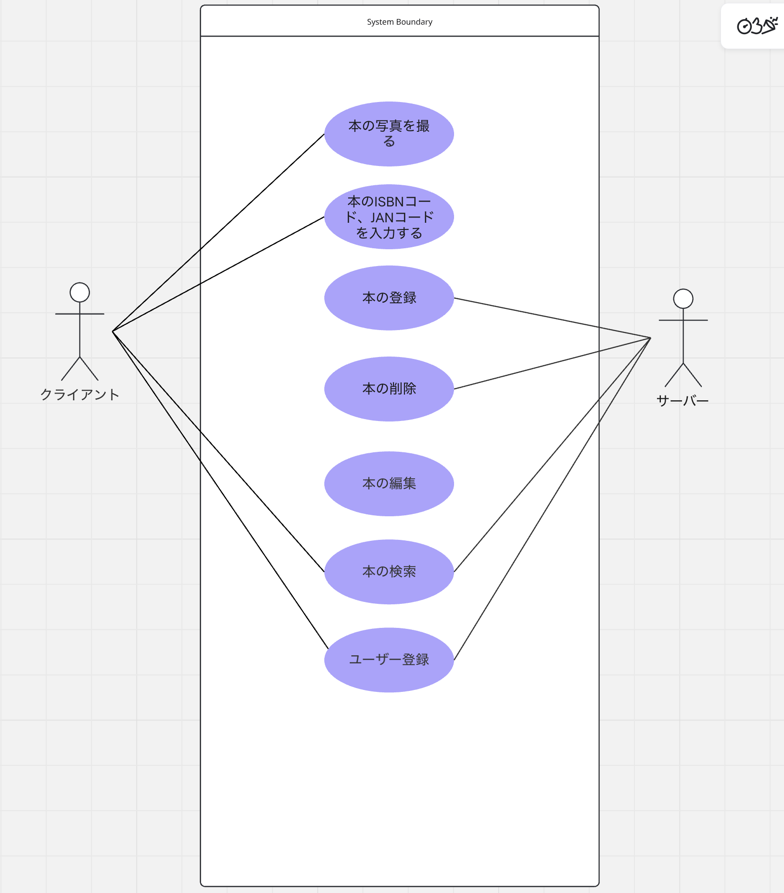
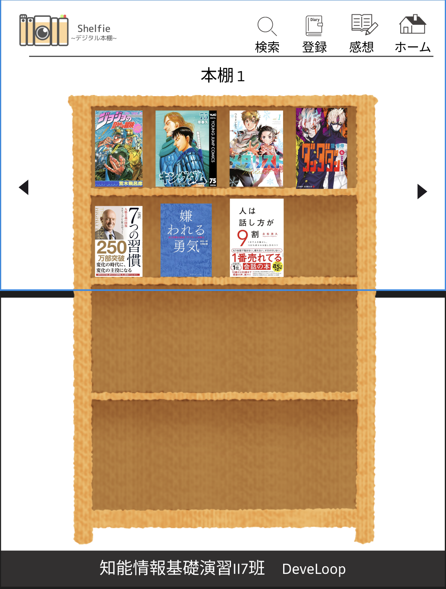
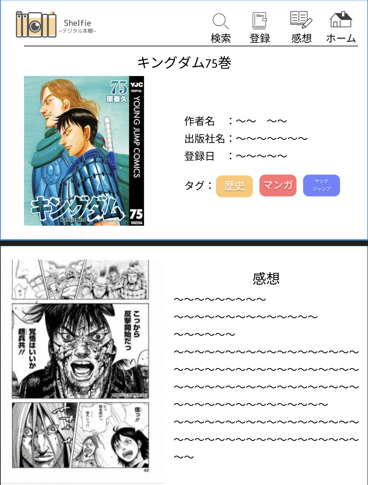
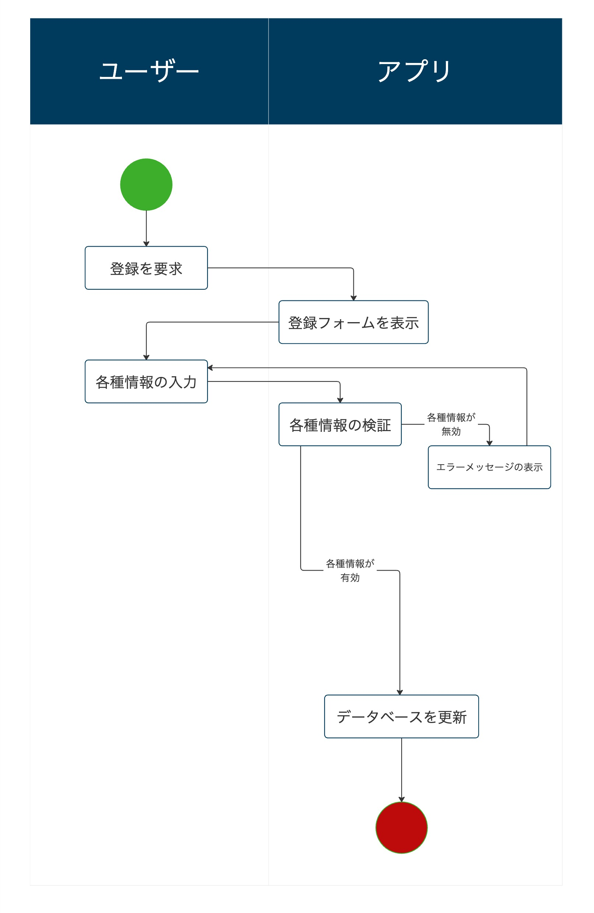
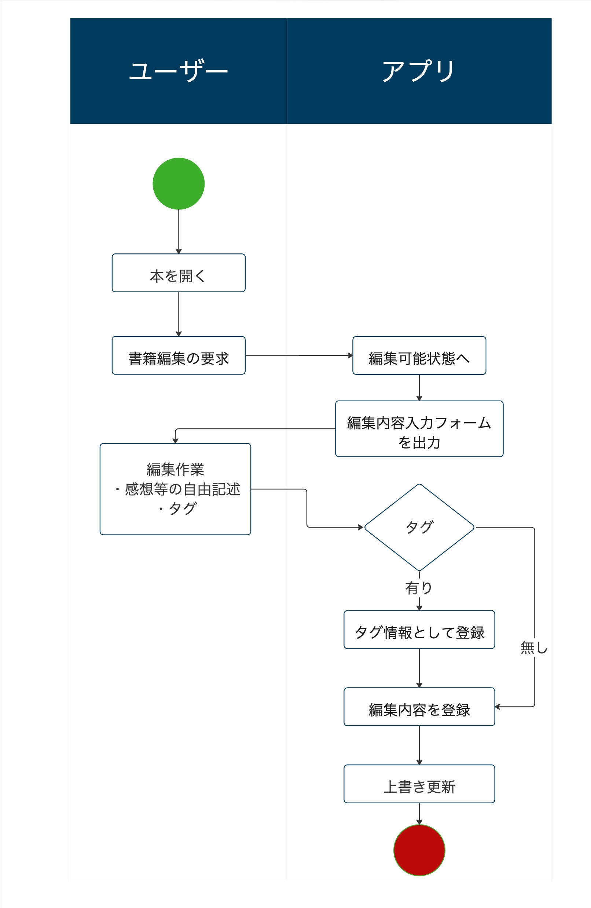
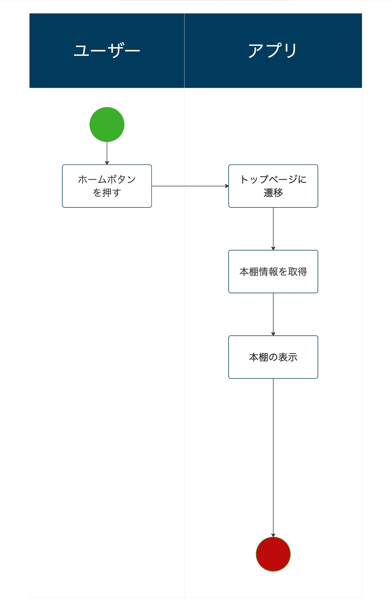

# Shelfie
## 主な機能（Features）
* 読んだ本の写真を撮って、デジタル本棚に本を飾ることができる。
* 本の情報を見たり、本に感想を書いたりできる。

## 制作環境(Tech Stack)
- フロントエンド
  - HTML（Jinja2）, CSS
- バックエンド
  - Python3
- フレームワーク
  - Flask
- 開発ツール
  - VSC
- バージョン管理システム
  - Git, Github

## 業務一覧
|識別子|業務名          |概要                    |備考                                      |
|----|:--------------|:-----------------------|:-----------------------------------------|
|BM01|書籍登録        |書籍の情報を登録する        |表紙画像、ISBN、JANコードタイトル、著者名、追加日|
|BM02|書籍検索        |書籍の情報を元に検索する     |ISBN、JANコード、タイトル、著者名、タグ        |
|BM03|書籍編集        |感想、メモの登録タグ付け機能 |タグ作成                                    |
|BM04|書籍削除        |登録書籍を削除する          |一括削除                                   |
|BM05|書籍一覧表示     |登録書籍を一覧表示する      |本棚表示                                   |

## 基本機能
|業務ID|機能ID|機能名|機能要件                  |入力                                   |出力                        |前提条件   |事後条件                            |優先度|
|----|:---|:-----|:-----------------------|:----------------------------------------|:--------------------------|:--------|:----------------------------------|:----|
|BM01|FN01|書籍登録|書籍情報登録.識別ID割り振り|表紙画像、ISBN、JANコードタイトル、著者名、追加日|表紙画像、完了メッセージ       |         |表紙画像が参照できる                   |高  |
|BM02|FN02|書籍検索|書籍の情報を元に検索する    |キーワード、著者名、タイトル、タグ、識別ID      |検索結果                    |         |                                    |中  |
|BM03|FN03|書籍編集|感想、メモの登録タグ付け機能 |識別ID、自由記述、タグ                      |完了メッセージ               |識別IDが存在|変更内容が反映される                  |高  |
|BM04|FN04|書籍削除|登録書籍を削除する         |識別ID                                    |完了メッセージ　             |識別IDが存在|本棚から本の削除、登録情報が削除されている|高  |
|BM05|FN05|書籍一覧表示|登録書籍を一覧表示する   |                                         |書籍一覧                   |           |表紙画像を元に本が表示される           |高  |
|BM06|FN06|お気に入りページ表示|感想文の横でお気に入りのページを表示|ページ画像                 |ページ画像                  |識別IDが存在|感想欄にページ画像が表示される          |    |

## データベース設計
### ブックテーブル（book）
| カラム名    | データ型           | 制約                                 | 説明               |
| :---------- | :----------------- | :----------------------------------- | :----------------- |
| book_id     | BIGINT             | PRIMARY KEY, AUTO_INCREMENT          | 本の識別子         |
| img         | BLOB               | NOT NULL                             | 本の表紙、ページ   |
| name        | VARCHAR(255)       | NOT NULL                             | 本のタイトル       |
| author      | VARCHAR(50)        | NOT NULL                             | 本の著者           |
| add_date    | TIMESTAMP          | NOT NULL, DEFAULT CURRENT_TIMESTAMP  | 本の追加日         |
| code        | VARCHAR(14)        | NOT NULL                             | ISBNコード         |
| memo        | VARCHAR(511)       | NOT NULL                             | 本の感想等自由記述（任意） |
| tag         | VARCHAR(10)        | NOT NULL                             | 本のタグ（任意）   |
| message     | VARCHAR(255)       | NOT NULL                             | 完了メッセージ等の管理 |

### 本棚テーブル（shelf）
| カラム名    | データ型           | 制約                                 | 説明               |
| :---------- | :----------------- | :----------------------------------- | :----------------- |
| shelf_id     | BIGINT             | NOT NULL          | 本棚の識別子         |
| book_id         | BIGINT               | NOT NULL                             | 本の識別子   |

## ユースケース


## ワイヤーフレームp
Figmaで作成。
**https://www.figma.com/design/QCJ4Nj0AJJR8wjoNjib8DP/%E7%9F%A5%E8%83%BD%E6%83%85%E5%A0%B1%E5%9F%BA%E7%A4%8E%E6%BC%94%E7%BF%922-DeveLoop%E7%8F%AD?node-id=0-1&t=lf2IbXf0TSpZQtSf-1**

### トップページ


### 詳細ページ


### ロゴ


## 処理フロー
### 書籍登録


### 書籍編集


### 書籍一覧表示


## ファイル構造
```
shelfie/
│
├── app.py                  # Flaskアプリケーションの本体
│
├── static/
│   ├── css/
│   │   └── style.css       # 全体のデザイン定義
│   │
│   └── images/             # 画像フォルダ
│
│
├── templates/
│   ├── base.html           # 全ページ共通のヘッダーやフッターを記述
│   ├── index.html          # トップページ
│   ├── detail.html         # 本の詳細ページ
│   ├── new.html            # 本の新規登録フォーム
│   └── edit.html           # 本の情報編集フォーム
│
├── shelfie_rep/            # レポートフォルダ
│
├── database.db             # SQLiteデータベース
│
└── README.md
```

## branch命名規則
1. develop      開発中のものを置くブランチで、mainにマージする
2. feature      新機能開発中に使うブランチで、developにマージする
3. hotfix       公開中のもののバグ修正用ブランチで、developにマージする

以下のファイルを参照した。
**https://qiita.com/Hashimoto-Noriaki/items/5d990e21351b331d2aa1**

## その他
 * MIRO
**https://miro.com/welcomeonboard/ZWRSczVkakZ0SVdwM1ZLMlRWdlp3WEV3TjhsbHp3MjY5bmVnOU5SOWJJb0RVQldMa0dLYzJMZHZCcldBckhiQlRoRFora3dLT2NFYWlnVkhGNWhkdVdudm8raHBIQm1ZcUwwNjE1cFJNM2hrSjZkSDF2bkRjT0ZpYW9tWEUyQk50R2lncW1vRmFBVnlLcVJzTmdFdlNRPT0hdjE=?share_link_id=75453222737**
 * GoogleDocument
**https://docs.google.com/document/d/1OxC9vIwPg9OnkA1INxzL3Cc6w8l5_IBOdQ-3EiBMKSQ/edit?usp=sharing**
